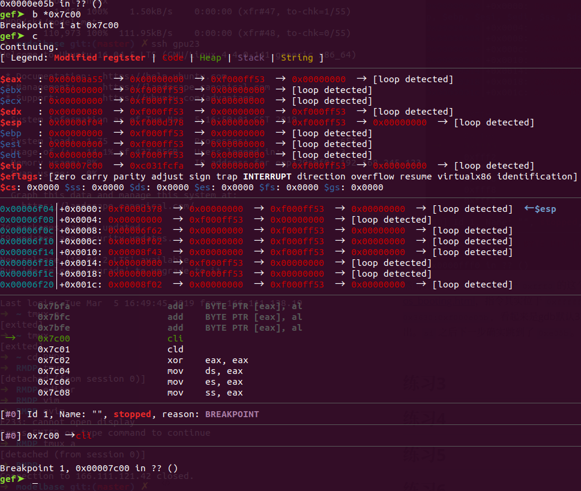
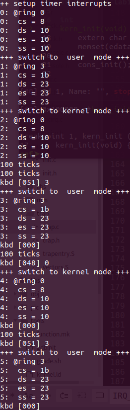

# Lab1

> 计64 翁家翌 2016011446

## 练习1

Q1：操作系统镜像文件ucore.img是如何一步一步生成的？(需要比较详细地解释Makefile中每一条相关命令和命令参数的含义，以及说明命令导致的结果)

使用命令 `make clean; make V= > make_output.log 2>&1` 生成make的过程，位于 `make_output.log` 中。大致可以分为如下几个步骤：

1. 编译内核代码，举例：

   ```bash
   + cc kern/init/init.c
   gcc -Ikern/init/ -fno-builtin -fno-PIC -Wall -ggdb -m32 -gstabs -nostdinc  -fno-stack-protector -Ilibs/ -Ikern/debug/ -Ikern/driver/ -Ikern/trap/ -Ikern/mm/ -c kern/init/init.c -o obj/kern/init/init.o
   ```

   参数含义：

   1. `-I`：编译时引用该文件目录；
   2. `-fno-builtin -nostdinc`：关闭内建库
   3. `-fno-PIC`：减小代码体积，否则无法生成bootloader（#22）
   4. `-Wall`：开启警告
   5.  `-ggdb -gstabs`：开启gdb调试功能
   6. `-m32`：生成32位代码
   7. ` -fno-stack-protector`：取消栈保护
   8. `-o`：输出文件

2. 链接生成kernel

   ```bash
   + ld bin/kernel
   ld -m    elf_i386 -nostdlib -T tools/kernel.ld -o bin/kernel  obj/kern/init/init.o obj/kern/libs/stdio.o obj/kern/libs/readline.o obj/kern/debug/panic.o obj/kern/debug/kdebug.o obj/kern/debug/kmonitor.o obj/kern/driver/clock.o obj/kern/driver/console.o obj/kern/driver/picirq.o obj/kern/driver/intr.o obj/kern/trap/trap.o obj/kern/trap/vectors.o obj/kern/trap/trapentry.o obj/kern/mm/pmm.o  obj/libs/string.o obj/libs/printfmt.o
   ```

   参数含义：

   1. `-m elf_i386`：生成32位ELF可执行文件
   2. `-nostdlib`：关闭内建库
   3. `-T tools/kernel.ld`：使用脚本 `toold/kernel.ld`
   4. `-o bin/kernel *.o`：使用一系列的 `.o` 文件生成 `bin/kernel`

3. 编译bootloader，举例：

   ```bash
   + cc boot/bootasm.S
   gcc -Iboot/ -fno-builtin -fno-PIC -Wall -ggdb -m32 -gstabs -nostdinc  -fno-stack-protector -Ilibs/ -Os -nostdinc -c boot/bootasm.S -o obj/boot/bootasm.o
   ```

   参数含义：同1，`-Os` 与 `-fno-PIC` 为对代码大小进行优化，否则无法塞入512字节

4. 生成bootloader

   ```bash
   + ld bin/bootblock
   ld -m    elf_i386 -nostdlib -N -e start -Ttext 0x7C00 obj/boot/bootasm.o obj/boot/bootmain.o -o obj/bootblock.o
   ```

   参数含义：

   1. `-N`：设置代码段和数据段均可读写，并且关闭动态链接
   2. `-e start`：设置入口点符号为start
   3. `-Ttext 0x7c00`：设置代码段起始地址为 `0x7c00`
   4. 其余同2

   之后生成二进制代码，使用 `objcopy` 和 `objdump`：

   ```bash
   @$(OBJDUMP) -S $(call objfile,bootblock) > $(call asmfile,bootblock)
   @$(OBJCOPY) -S -O binary $(call objfile,bootblock) $(call outfile,bootblock)
   ```

   参数含义：

   1. `-S`：不拷贝relocation和debug信息
   2. `-O`：拷贝二进制代码

5. 编译sign.c，判断 `obj/bootblock.out` 大小是否超过510字节

6. 生成ucore.img

   ```bash
   dd if=/dev/zero of=bin/ucore.img count=10000
   记录了10000+0 的读入
   记录了10000+0 的写出
   5120000 bytes (5.1 MB, 4.9 MiB) copied, 0.0138703 s, 369 MB/s
   dd if=bin/bootblock of=bin/ucore.img conv=notrunc
   记录了1+0 的读入
   记录了1+0 的写出
   512 bytes copied, 6.4636e-05 s, 7.9 MB/s
   dd if=bin/kernel of=bin/ucore.img seek=1 conv=notrunc
   记录了146+1 的读入
   记录了146+1 的写出
   74820 bytes (75 kB, 73 KiB) copied, 0.000219237 s, 341 MB/s
   ```

   第一个dd是写0到 `ucore.img` 中，大小为5120000字节；第二个dd是把 `bin/bootblock` 写入 `ucore.img`，`conv=notrunc` 表示不覆盖之前的数据；第三个dd 将 `bin/kernel` 写入 `ucore.img`，`seek=1` 表示从第一扇区开始写，同样不覆盖之前的数据。


Q2：一个被系统认为是符合规范的硬盘主引导扇区的特征是什么？

通过查看 `tools/sign.c`，可以看出扇区大小为512字节，并且最后两位分别为 `0x55` 和 `0xAA`。

## 练习2

将 `tools/gdbinit` 中的最后一行continue删掉，随后使用 `make debug-nox` 开始运行（由于我gdb是gef拓展，tui参数会挂）。

首先停在了 `0xfff0` 位置，`cs=0xf000`，`eip=0xfff0`，如下图所示：


然而真正的指令并不是位于 `0xfff0` 的这个，根据 https://chyyuu.gitbooks.io/ucore_os_docs/lab1/lab1_3_1_bios_booting.html，指令其实位于 `0xfffffff0` 处。直接查看：输入 `x/i 0xfffffff0` 会得到 `jmp 0x3630:0xf000e05b`，看起来是gdb默认32位，可是我输入命令 `set arch i8086` 之后再次执行，还是同一输出。`si` 之后下一步确实跳到了 `0xe05b`。

使用命令 `b *0x7c00` 设置断点，结果如下：



可以看到 `0x7c00` 之后一串的汇编代码，与 `boot/bootasm.S` 的16行到23行一致，也与 `obj/bootblock.asm`  中 `code16` 代码段一致。

从 `obj/bootblock.asm` 中可以看出 `seta20` 代码段起始地址位于 `0x7c0a`，设置断点之后进行测试，验证与 `obj/bootblock.asm` 和 `boot/bootasm.S` 中的汇编代码均一致。

## 练习3

根据 `boot/bootasm.S` 中的代码，具体分为如下几个步骤：

1. 开启A20地址线：（line 29-43）根据 https://chyyuu.gitbooks.io/ucore_os_docs/content/lab1/lab1_appendix_a20.html，分为如下小步骤：
   1. 等待直到8042不忙，之后写入0xd1到0x64端口，意为写P2
   2. 等待直到8042不忙，之后写入0xdf到0x60端口，意为置P2的A20位为1
2. 配置GDT并开启保护模式：（line 49-52，77-87）
   1. GDT强制4字节对齐，生成三个描述符：空描述符、代码段描述符和数据段描述符；之后使用 `lgdt` 命令加载
   2. 将 `%cr0` 的最低位（表示PE）置为1，开启保护模式
3. 使用 `ljmp` 命令跳转至32位代码段起始地址（line 56-71）：将CS寄存器设置为代码段选择子，进入32位保护模式，依次初始化 ds、es、fs、gs、ss，并使 ebp 为 0，esp 为 start（0x7c00），调用 `bootmain` 函数

## 练习4

根据 `boot/bootmain.c` 中的代码，读取硬盘扇区步骤大致如下（函数 `readsect`）：

1. 等待 IO 直到不忙
2. 依次向 IO 地址 `0x1f2 - 0x1f7` 写入读取参数
3. 等待 IO 直到不忙
4. 使用 `insl` 命令读取硬盘数据至指定内存区域中

加载 ELF 格式的 OS 步骤大致如下（函数 `bootmain`）：

1. 读取硬盘第一个扇区
2. 查看 ELF 格式是否合法，是否是 `0x464C457F`，如果不合法直接挂起
3. 根据 ELF Header，依次读取硬盘特定位置的扇区至内存中
4. 跳转至 ELF 的入口地址 `e_entry`

## 练习5

照着注释翻译成代码如下：

```c
void print_stackframe(void) {
    uint32_t ebp, eip, i;
    ebp = read_ebp();
    eip = read_eip();
    for (i = 0; i < STACKFRAME_DEPTH; ++i) {
        cprintf("ebp:0x%08x eip:0x%08x args:0x%08x 0x%08x 0x%08x 0x%08x\n", ebp, eip, *((uintptr_t*)ebp+2), *((uintptr_t*)ebp+3), *((uintptr_t*)ebp+4), *((uintptr_t*)ebp+5));
        print_debuginfo(eip - 1);
        eip = *((uintptr_t*)ebp+1);
        ebp = *((uintptr_t*)ebp);
        if (ebp == 0)
            break;
    }
}
```

上一个栈帧的eip为当前的return addr，因此必须先更新eip再更新ebp。

qemu 输出结果如下所示：

```c
(THU.CST) os is loading ...

Special kernel symbols:
  entry  0x00100000 (phys)
  etext  0x00103252 (phys)
  edata  0x0010ea16 (phys)
  end    0x0010fd20 (phys)
Kernel executable memory footprint: 64KB
ebp:0x00007b38 eip:0x00100a3d args:0x00010094 0x00010094 0x00007b68 0x0010007f
    kern/debug/kdebug.c:296: print_stackframe+22
ebp:0x00007b48 eip:0x00100d12 args:0x00000000 0x00000000 0x00000000 0x00007bb8
    kern/debug/kmonitor.c:125: mon_backtrace+10
ebp:0x00007b68 eip:0x0010007f args:0x00000000 0x00007b90 0xffff0000 0x00007b94
    kern/init/init.c:48: grade_backtrace2+19
ebp:0x00007b88 eip:0x001000a1 args:0x00000000 0xffff0000 0x00007bb4 0x00000029
    kern/init/init.c:53: grade_backtrace1+27
ebp:0x00007ba8 eip:0x001000be args:0x00000000 0x00100000 0xffff0000 0x00100043
    kern/init/init.c:58: grade_backtrace0+19
ebp:0x00007bc8 eip:0x001000df args:0x00000000 0x00000000 0x00000000 0x00103260
    kern/init/init.c:63: grade_backtrace+26
ebp:0x00007be8 eip:0x00100050 args:0x00000000 0x00000000 0x00000000 0x00007c4f
    kern/init/init.c:28: kern_init+79
ebp:0x00007bf8 eip:0x00007d6e args:0xc031fcfa 0xc08ed88e 0x64e4d08e 0xfa7502a8
    <unknow>: -- 0x00007d6d --
++ setup timer interrupts
```

最后一行为

```c
ebp:0x00007bf8 eip:0x00007d6e args:0xc031fcfa 0xc08ed88e 0x64e4d08e 0xfa7502a8
    <unknow>: -- 0x00007d6d --
```

表示 ebp 为 0 时调用的第一个函数 bootmain

typo：unknow -> unknown

`0x00007bf8` 为 `bootmain` 的栈帧基址

`0x00007d6e` 是 ELF 跳转语句的后一条语句的地址，也是 `bad` 标签地址

由于 `bootmain` 并没有参数，因此 args 为调用该函数之前栈上的值。args 和 `obj/bootblock.asm` 中的代码对应，比如 `0xc031fcfa`，按照小端序翻译为 `fa fc 31 c0` 恰好对应代码14行开始的 `cli; cld; xor %eax %eax;`。

## 练习6

Q1：中断描述符表（也可简称为保护模式下的中断向量表）中一个表项占多少字节？其中哪几位代表中断处理代码的入口？

从 `kern/mm/mmu.h` 的50-60行可以看出：一个表项8字节，0-15位为段偏移的0-15位，16-31位为段选择子，48-63位为段偏移的16-31位，共同决定代码入口。

Q2：请编程完善kern/trap/trap.c中对中断向量表进行初始化的函数idt_init。在idt_init函数中，依次对所有中断入口进行初始化。使用mmu.h中的SETGATE宏，填充idt数组内容。每个中断的入口由tools/vectors.c生成，使用trap.c中声明的vectors数组即可。

翻译注释之后，代码如下所示：

```c
void idt_init(void) {
    extern uintptr_t __vectors[];
    int i;
    for (i = 0; i < 256; ++i)
        SETGATE(idt[i], 0, KERNEL_CS, __vectors[i], DPL_KERNEL);
    SETGATE(idt[T_SYSCALL], 1, KERNEL_CS, __vectors[T_SYSCALL], DPL_USER);
    lidt(&idt_pd);
}
```

由于调用 `SYSCALL` 不需要高权限，因此设置为 `DPL_USER`

Q3：请编程完善trap.c中的中断处理函数trap，在对时钟中断进行处理的部分填写trap函数中处理时钟中断的部分，使操作系统每遇到100次时钟中断后，调用print_ticks子程序，向屏幕上打印一行文字”100 ticks”。

翻译注释之后，代码如下所示：

```c
case IRQ_OFFSET + IRQ_TIMER:
    ++ticks;
    if (ticks % TICK_NUM == 0)
        print_ticks();
    break;
```

执行 `make qemu` 之后继续输出如下

```bash
++ setup timer interrupts
100 ticks
100 ticks
qemu-system-i386: terminating on signal 2
```

## 拓展1

以内核态到用户态为例，要改两个地方

1. `kern/init/init.c`：修改 `lab1_switch_to_user`，使用汇编代码触发中断。由于中断在内核态产生，因此处理器没有压入ss和esp，需要预留出这两个寄存器的压栈空间。在 https://chyyuu.gitbooks.io/ucore_os_docs/content/lab1/lab1_2_1_7_ex7.html 的 “注意2” 中已经给出相应的汇编代码。
2. `kern/trap/trap.c`：设置好trapframe参数
   1. cs设为用户代码段选择子，其他设置为用户数据段选择子
   2. esp设置为 `lab1_switch_to_user` 的return address
   3. 设置eflags的IOPL使得在用户态可以进行IO
   4. ss设置为一个临时的用户态栈，代码中为 `new_tf`

用户态到内核态同理，不用为ss和esp预留空间，但是需要在中断向量表初始化最后添加对 `T_SWITCH_TOK` 的初始化，如下所示：

```c
SETGATE(idt[T_SWITCH_TOK], 1, KERNEL_CS, __vectors[T_SWITCH_TOK], DPL_USER);
```

## 拓展2

在 `kern/trap/trap.c` 中的 `IRQ_KBD` 处添加如下代码：

```c
if (c == '3') TOU(tf);
if (c == '0') TOK(tf);
```

但我想把拓展1中的输出也放进来，于是添加了个 `init.h`，然后改了下makefile，发现不对，用户态没法输入……

仔细分析了一波，发现eflag最开始是 `0x202` 到 `0x3202`，之后是从 `0x12` 到 `0x3012`，对比一下发现IF被关了，于是把IF开起来就能正常切换了，代码如下：

```c
user_tf.tf_eflags |= FL_IOPL_MASK | FL_IF;
```

效果如下所示：



## 总结

#### 本实验中重要的知识点，以及与对应的OS原理中的知识点

1. Makefile：生成镜像、bootloader的过程
2. A20
3. GDT
4. 中断描述符表
5. 中断处理过程
6. ELF格式
7. 磁盘读取
8. 函数堆栈
9. 特权转换、中断堆栈切换

#### 本实验中没有对应的

无