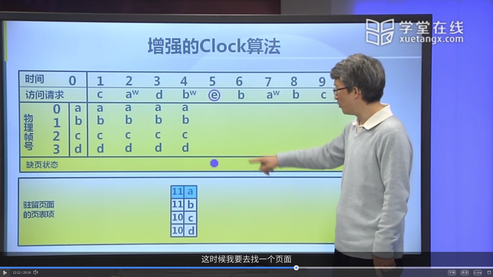
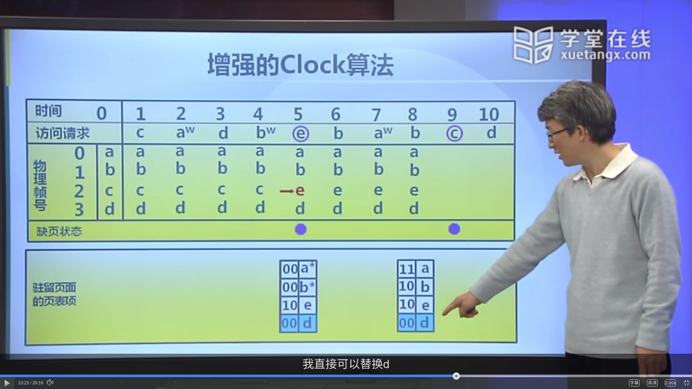
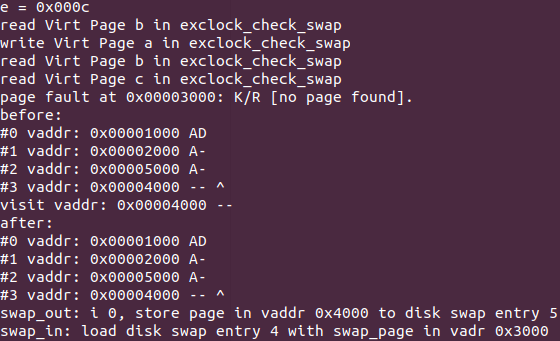
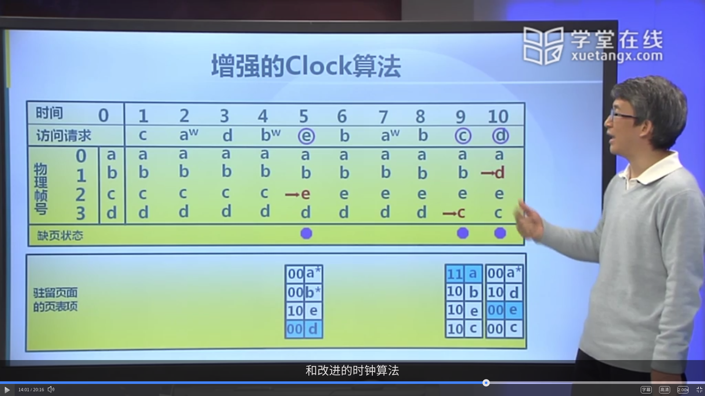
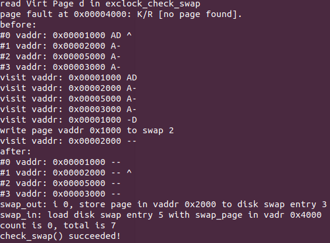

# Lab3

> 计64 翁家翌 2016011446 

## 练习1

翻译注释即可。

PTE和PDE的组成基本相同，均为高20位为基址，低12位为各种标志位，标志位的各项含义详见 Lab2 报告中的具体描述，这里指出在本次实验中有用的位：

| 位   | 名称 | 含义 | 用法 |
| ---- | ---- | ---- | --- |
| 0     | P     | 页面是否在内存中，若此位为0则其他位可随意使用                           |存放交换分区信息，可用于页替换算法实现|
| 5     | A     | 在上次清零之后，该页是否被访问（读或写）过  |可用于时钟替换算法和拓展时钟替换算法的实现|
| 6 | D | 在上次清零之后，该页是否被写过 |可用于拓展时钟替换算法实现|

如果ucore执行过程中访问内存，出现了页访问异常，根据 https://chyyuu.gitbooks.io/ucore_os_docs/content/lab3/lab3_4_page_fault_handler.html ，CPU把引起页访问异常的线性地址装到寄存器CR2中，并给出了出错码errorCode，说明了页访问异常的类型。并且CPU在当前内核栈保存当前被打断的程序现场，即依次压入当前被打断程序使用的EFLAGS，CS，EIP，errorCode。随后查询IDT找到中断服务程序入口点，把例程的地址加载到CS和EIP寄存器中，开始执行中断服务例程。

## 练习2

翻译注释即可。

足以支持。设计方案见拓展1。

需要被换出的页特征是 `PTE_A` 和 `PTE_D` 位均为0，通过循环链表按顺序遍历查找即可找出所有这种页。

通过遍历循环链表，可以依次查找出所有能够被换出的页。遍历时候根据时钟置换算法修改标志位，详见拓展1。

页换入条件：在 `do_pagefault` 函数中，如果虚拟地址对应的PTE是swap entry（`*ptep != 0`），并且swap初始化完毕，则会根据该PTE所对应的页面从swap分区换入。

页换出条件：在 `alloc_pages` 函数中，如果`pmm_manager->alloc_pages` 返回page为空，并且需要分配页面个数为1，并且swap初始化完毕，则会进行页换出操作。

## 拓展1

### 算法设计

算法严格按照MOOC所演示的执行过程，源代码位于 `kern/mm/swap_exclock.c` 中，具体改动可查看 `lab3_clock` 分支的最后一个commit，即 https://github.com/oscourse-tsinghua/os2019-Trinkle23897/commit/6af7b5e85888575f374d36c3169de5f5f4eb9a77

主要维护了当前的时钟指针clock，修改了 `map_swappable` 和 `swap_out_victim` 两个函数。具体执行过程如下：

1. 在初始化阶段，物理页面尚未被完全分配，此时调用 `map_swappable` 函数可将新的物理页面装入链表中；
2. 当调用了一次页缺失异常之后，说明所有物理内存分配完毕，此时禁止掉 `map_swappable` 函数的调用，只需要将目标物理页面返回，并不需要在已有链表中删除之后重新插入。

在维护clock的同时，根据A位和D位的不同，一共会有四种情况：

1. A=0, D=0：说明该页可以被替换，clock指针跳到链表下一项，返回；
2. A=0, D=1：调用 `swapfs_write` 函数，将该页面写入交换分区，之后将D修改为0，clock指针跳到链表下一项；
3. A=1：此时将A修改为0，clock指针跳到链表下一项。

### 测试用例

使用MOOC上所演示的测试用例，代码如下：

```c
static int _exclock_check_swap(void) {
    // clear all AD
    pde_t *pgdir = KADDR((pde_t*) rcr3());
    for (int i = 1; i <= 4; ++i) {
        pte_t *ptep = get_pte(pgdir, i * 0x1000, 0);
        swapfs_write((i * 0x1000 / PGSIZE + 1) << 8, pte2page(*ptep));
        *ptep &= ~(PTE_A | PTE_D);
        tlb_invalidate(pgdir, i * 0x1000);
    }
    assert(pgfault_num == 4);
    cprintf("read Virt Page c in exclock_check_swap\n");
    assert(*(unsigned char *)0x3000 == 0x0c);
    assert(pgfault_num == 4);
    cprintf("write Virt Page a in exclock_check_swap\n");
    assert(*(unsigned char *)0x1000 == 0x0a);
    *(unsigned char *)0x1000 = 0x0a;
    assert(pgfault_num == 4);
    cprintf("read Virt Page d in exclock_check_swap\n");
    assert(*(unsigned char *)0x4000 == 0x0d);
    assert(pgfault_num == 4);
    cprintf("write Virt Page b in exclock_check_swap\n");
    assert(*(unsigned char *)0x2000 == 0x0b);
    *(unsigned char *)0x2000 = 0x0b;
    assert(pgfault_num == 4);
    cprintf("read Virt Page e in exclock_check_swap\n");
    unsigned e = *(unsigned char *)0x5000;
    cprintf("e = 0x%04x\n", e);
    assert(pgfault_num == 5);
    cprintf("read Virt Page b in exclock_check_swap\n");
    assert(*(unsigned char *)0x2000 == 0x0b);
    assert(pgfault_num == 5);
    cprintf("write Virt Page a in exclock_check_swap\n");
    assert(*(unsigned char *)0x1000 == 0x0a);
    *(unsigned char *)0x1000 = 0x0a;
    assert(pgfault_num == 5);
    cprintf("read Virt Page b in exclock_check_swap\n");
    assert(*(unsigned char *)0x2000 == 0x0b);
    assert(pgfault_num == 5);
    cprintf("read Virt Page c in exclock_check_swap\n");
    assert(*(unsigned char *)0x3000 == 0x0c);
    assert(pgfault_num == 6);
    cprintf("read Virt Page d in exclock_check_swap\n");
    assert(*(unsigned char *)0x4000 == 0x0d);
    assert(pgfault_num == 7);
    return 0;
}
```

其中初始化是一个比较头疼的问题，因为如果按照正常操作的话，无法产生全0的情况。因此必须手动清除。代码和之前核心算法中写入交换分区部分基本一致。

### 运行结果




在读入e之前，页表项状态为 `^a11b11c10d10`，我的输出结果与其吻合，为 `before:`下面的四行。

寻找可替换的页的步骤在输出结果中是带有 `visit vaddr` 的行，与演示视频吻合。

最后找到并替换c，我输出的结果再次符合。





可以看到替换之前为 `a11b10e10^d00`，输出结果正确；替换最后一个页面。





可以看到替换之前为 `^a11b10e10c10`，替换第二个页面。输出结果正确。

## 总结

#### 本实验中重要的知识点，以及与对应的OS原理中的知识点

1. FIFO
2. 拓展时钟替换算法
3. 缺页异常

#### 本实验中没有对应的

1. 最优算法、LRU、最不常用算法
2. Belady现象
3. 全局页替换算法
4. 抖动和负载控制