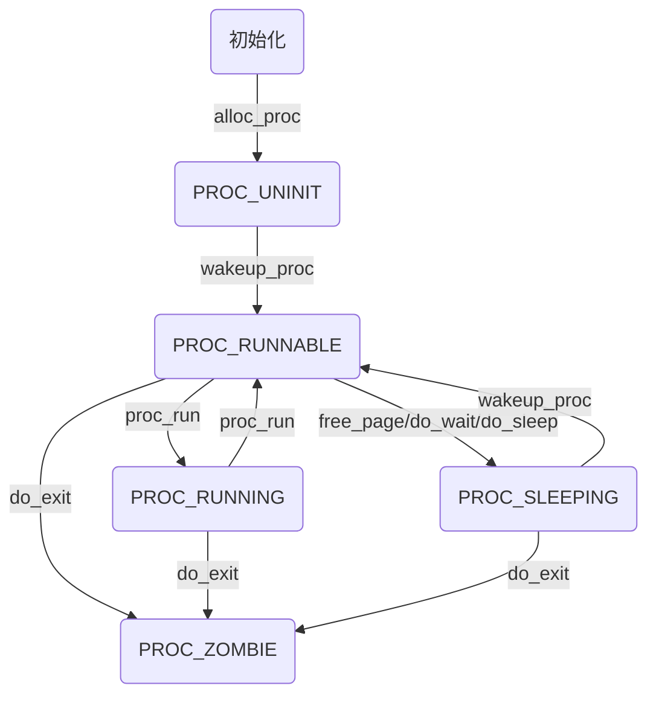

# Lab5

> 计64 翁家翌 2016011446

## 练习0

有一个小坑：在原来handle时钟中断代码的地方，不能再输出打印信息了，不然会把整个ucore卡死。我分析了一下还是因为EFLAGS中的IF设置问题，反正注释掉那句cprintf就行了。

##  练习1

翻译注释即可。感觉还是LAB8的load_icode有难度，这个……真没什么工作量，就是设置一下tf，并且还和LAB1的challenge那么像

当创建一个用户态进程并加载了应用程序后，CPU让这个应用程序最终在用户态执行起来的整个经过如下：

1. 关闭中断
2. 修改 `current`，令其指向该进程
3. 载入该进程内核栈的 `esp` 和页目录表起始地址 `cr3`
4. 调用 `switch_to` 函数进行上下文切换，由于在之前的 `copy_thread` 中设置了 `context` 的 `esp` 和 `eip`，`ret` 会跳转到 `forkret`
5. `forkret` 跳转到 `__trapret`
6. `__trapret` 根据 `tf` 的信息恢复上下文，恢复各个段选择子，最后使用 `iret` 指令回到用户态

## 练习2

翻译注释即可。

COW简要设计如下：

1. 不像原来代码那样直接使用memcpy拷贝页，而是先判断操作，如果是读操作则将原来的页W置为0，刷新TLB，直接返回原来页信息；如果是写，则再进行拷贝操作。需要修改 `do_pgfault` 中的相关代码
2. 如果某个页面引用计数为1，说明并没有其他进程共享该页面，在写操作的时候可以直接写，而不必复制
3. 如果有进程尝试写一个只读页面，则抛出异常，说明页表中的权限和进程中的权限不一致，在异常处理的时候拷贝这个页面给该进程，修改页表，重新映射虚拟地址，并且W置为1

## 练习3

### fork

fork 创建新的进程 proc，此时进程状态为 `UNINIT`，然后将大部分原来进程信息复制过去，但是新建了内核栈、`eax`、`esp`、`eflags`。调用函数 `wakeup_proc` 之后进程状态为 `RUNNABLE`

### exec

exec 清除当前进程的内存布局 `mm`，之后调用 `load_icode` 从二进制ELF格式串中建立起新的 `mm`。在这个过程中，进程状态不会发生变化。

### wait

涉及到当前进程和子进程。只有有子进程的时候才会被正常执行。进程先会被设置成 `SLEEPING` 状态，接着一直等到有 `ZOMBIE` 状态的子进程出现，释放它的占用的资源，然后返回子进程的 `exit_code`。

### exit

涉及到当前进程和父进程。首先会清除当前进程占用资源，将状态设置为 `ZOMBIE`，如果有父进程并且父进程等待子进程退出，则将父进程的状态从 `SLEEPING` 转变为 `RUNNABLE`，随后将该进程所有子进程的父进程设置为 `initproc`，之后唤醒 `initproc`。

### 调用图

Please use typora markdown editor to look at this graph.

## 总结

#### 本实验中重要的知识点，以及与对应的OS原理中的知识点

1. 进程状态模型
2. 用户进程
3. ELF格式

#### 本实验中没有对应的

1. 挂起的进程